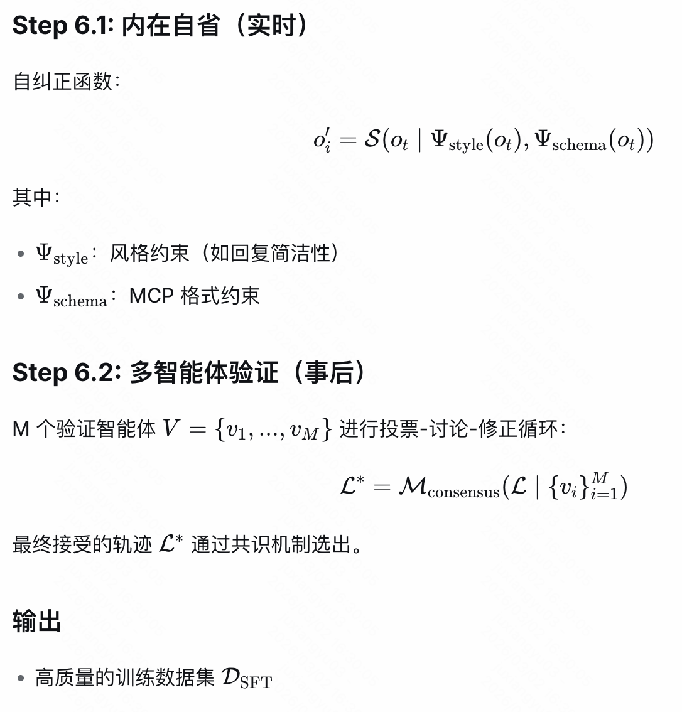
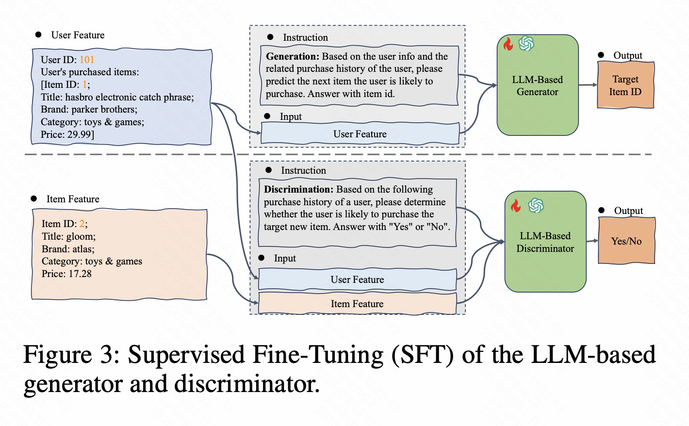

## Close the Loop: Synthesizing Infinite Tool-Use Data via Multi-Agent Role-Playing（InfTool）

​	学习根据query进行不同mcp的调用的过程，而后针对难样本，根据用户query模拟的输入来生成新的训练数据。

1. MCP tool的获取与精简：从RapidAPI获取17w的tool，每个tool有一个EmbedddingGemma分配的语义向量，离线通过kmeans对tool进行聚类，用一个LLM对于每个聚类内的tool分离成冗余tool集和独特tool集，对于前者会聚合成数量更少的tool，迭代n步最终得到3k的tool。
2. 多智能体：
   1. User Simulator
   2. Tool Agent（To be trained）
   3. MCP Server Simulator
3. 层次化数据合成训练（SFT）
   1. 单轮数据合成
   2. 多轮数据合成
4. 质量保证

5. GRPO优化：Rollout根据一致性分数与阈值，对qa对分成easy与hard两类，根据hard样本数据合成新数据，将合成的数据加入训练集，进行下一轮RL

### LLM GAN方式数据增强

https://arxiv.org/pdf/2512.21595

考虑判别器识别为伪阴的为困难样本进行生成？

### 因果与反因果式生成

https://dl.acm.org/doi/epdf/10.1145/3773966.3779380

因果：根据文本生成标签

反因果：将标签嵌入prompt生成合适的文本（大多数）

主要分析两种数据合成方式的影响。

在三个文本分类任务上分别用两种方式合成，反因果方式生成的标签错误率低，但是让训练的模型性能下降更大，相当于引入分布偏差，影响泛化能力。具体根据分布偏移指标进行分析，发现合成数据与真实数据差异较大，即使是因果数据也会有较大偏差，同时长文本会放大偏移。

未来方向：可以考虑因果与反因果数据的混合。

------------------------------------------------------------------------------------------------------------------------------------------------------

~~diffusion：遗忘难的样本再进行相应生成?~~

### Efficient Source-free Unlearning via Energy-Guided Data Synthesis and Discrimination-Aware Multitask Optimization

用gpt看着估计样本的一个能量函数建模要遗忘的类别的数据的分布，根据随机噪声来合成数据，感觉可以根据这个对于遗忘难的样本进行合成类似数据？

具体细节还需要看看论文

对于分类任务，在原始数据无法获取的情况下，如何遗忘某类数据？

1. 根据模型输出的分布，合成类似原始分布的数据，根据分布从噪声合成具体图像数据，分别根据要遗忘的类别和要保留的类别进行数据合成

2. 在要遗忘的类别合成的数据上遗忘、要保留的类别合成的数据上记忆，并将一个梯度投影到另一个梯度上，来调解梯度冲突。